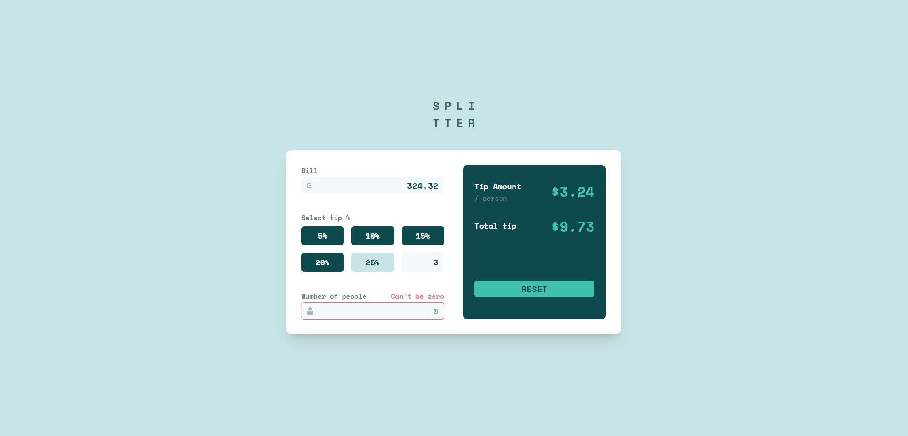

This is a solution to the [Tip calculator app challenge on Frontend Mentor](https://www.frontendmentor.io/challenges/tip-calculator-app-ugJNGbJUX).

It was a fun challenge building this simple tip calculator app. I tried to make it work as close to the original design as posible.

## Table of contents

- [The challenge](#the-challenge)
  - [Screenshot](#screenshot)
  - [Links](#links)
- [Built with](#built-with)
  - [What I learned](#what-i-learned)

### The challenge

All users should be able to:

- View the optimal layout for the app depending on their device's screen size
- See hover states for all interactive elements on the page
- Calculate the correct tip and total cost of the bill per person
- Make calculations happen whenever one parameter is changed
- Reset the whole app with the RESET button

### Screenshot

### Links

- Live Site URL: https://jure-tip-calculator.netlify.app/

### Built with

- Semantic HTML5 markup
- CSS custom properties
- Flexbox
- CSS Grid
- Tailwind
- [React](https://reactjs.org/)

### What I learned

Adding red alerts when user's input is wrong happend to be little tricky, but I managed to do it. Other things were fairly straight forward, like optimizing the app to work on various screen sizes and making the app recalculate everything again when user changes one input. Interestingly, adding .svg icon into the input field required a little bit more effort than I expected, but I did it without many isuess.

The project is small, but still a decent challenge if you give yourself a fixed amount of time to complete it.
